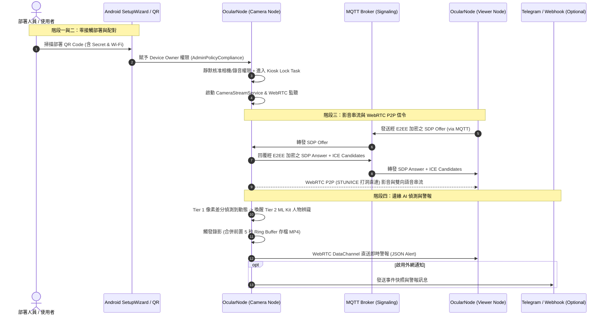

# OcularNode 系統架構規格書 (Architecture Specification Whitepaper)

> **版本**：v2.0.0 (WebRTC P2P & LAN Direct)  
> **定位**：無人值守 P2P 去中心化智慧安防監控節點系統 (100% Zero-Central-Server & Zero-Touch)  
> **授權**：GNU General Public License v3.0 (GPL-3.0)

---

## 📑 目錄 (Table of Contents)
1. [系統總覽與設計哲學](#1-系統總覽與設計哲學)
2. [第一階段：基礎架構與權限分流 (Unified APK & Device Owner)](#2-第一階段基礎架構與權限分流-unified-apk--device-owner)
3. [第二階段：網路與 WebRTC P2P 信令層 (WebRTC NAT Traversal & E2EE)](#3-第二階段網路與-webrtc-p2p-信令層-webrtc-nat-traversal--e2ee)
4. [第三階段：影音擷取與 WebRTC P2P 串流層 (MediaCodec & Hardware Acceleration)](#4-第三階段影音擷取與-webrtc-p2p-串流層-mediacodec--hardware-acceleration)
5. [第四階段：邊緣 AI 運算、事件偵測與在地存儲層 (Edge AI & Storage)](#5-第四階段邊緣-ai-運算事件偵測與在地存儲層-edge-ai--storage)
6. [全系統架構資料流圖 (System Data Flow Diagram)](#6-全系統架構資料流圖-system-data-flow-diagram)
7. [安全防護、容錯與自癒機制 (Resilience & Watchdogs)](#7-安全防護容錯與自癒機制-resilience--watchdogs)

---

## 1. 系統總覽與設計哲學

OcularNode 旨在將閒置的舊 Android 智慧型手機轉化為工業級、高度自主且無人值守的 P2P 智慧監控攝影機節點（Camera Node），並相容一般手機作為監控端（Viewer Node）。

### 核心設計原則：
* **100% 零中央伺服器 (Zero Central Server)**：不依賴任何外部雲端中繼錄影主機，保障 100% 數位主權與隱私。
* **純粹 WebRTC P2P 與 LAN 直連**：支援區域網路極速直連（含 IPv6）與 Google WebRTC P2P (STUN/ICE 打洞)，無需安裝任何第三方 VPN 軟體。
* **零接觸部署 (Zero-Touch Provisioning)**：利用 Android Device Owner (DO) MDM 機制，掃描 QR Code 後全程自動化配置。
* **資源受限防護 (Hardware-Conscious / Anti-Thermal)**：針對舊手機散熱不良、電池老化等痛點，建立多層次溫控與動態降頻保護。
* **無人值守自我修復 (Self-Healing Watchdogs)**：斷網、斷電重啟、程序被殺皆能自癒復原。

---

## 2. 第一階段：基礎架構與權限分流 (Unified APK & Device Owner)

### 2.1 單一安裝包角色分流 (Unified APK Routing)
* **單一二進位包 (Single APK)**：鏡頭端與觀看端共用同一份 APK。
* **自動分流機制**：
  * App 啟動時透過 `DevicePolicyManager.isDeviceOwnerApp(packageName)` 進行特權判定。
  * **Device Owner = true**：強制固定為 `CAMERA` 模式，跳過使用者角色選擇畫面，立即進入相機服務初始化管線。
  * **Device Owner = false**：預設進入 `VIEWER` 模式，使用者可手動切換至相機模式或觀看模式。

### 2.2 鎖定模式 (Kiosk Mode / Lock Task Mode)
* **Kiosk 螢幕死鎖**：
  * 鏡頭端在啟動後透過 `dpm.setLockTaskPackages(admin, arrayOf(packageName))` 註冊白名單，並呼叫 `activity.startLockTask()`。
  * 徹底禁用系統導覽列（Home、Back、Overview/Recents），屏蔽通知列下拉與系統對話框。
* **管理員逃生門 (Escape Hatch)**：
  * UI 隱藏區域連續點擊觸發管理員密碼驗證彈窗。
  * 驗證通過後呼叫 `activity.stopLockTask()`，允許工程人員進行本機除錯或維護。
* **偽黑屏防烙印模式 (OLED Burn-in Protection / Pure Black)**：
  * 鏡頭端提供全黑省電覆蓋層，關閉背光或以全黑像素運作，大幅降低發熱並防止 OLED 螢幕烙印，背景相機管線維持全速運作。

### 2.3 靜默權限核准 (Silent Dangerous Permissions Grant)
* **免彈窗全自動授權**：利用 `dpm.setPermissionGrantState()` 靜默核准：
  * `android.Manifest.permission.CAMERA`
  * `android.Manifest.permission.RECORD_AUDIO`
  * `android.Manifest.permission.POST_NOTIFICATIONS` (Android 13+)
  * `android.Manifest.permission.ACCESS_FINE_LOCATION`
* **電池最佳化豁免 (Battery Optimization Bypass)**：
  * DO 模式下抑制系統設定引導彈窗，透過前景服務 (`ForegroundService`) 與 `PARTIAL_WAKE_LOCK` 實現永久常駐。

---

## 3. 第二階段：網路與 WebRTC P2P 信令層 (WebRTC NAT Traversal & E2EE)

### 3.1 QR Code 部署參數傳遞 (Provisioning Bundle)
* 出廠重置掃碼時，透過 `EXTRA_PROVISIONING_ADMIN_EXTRAS_BUNDLE` 傳遞 JSON 參數：
  * `mqtt_device_secret`：AES-128-GCM 端對端加密密鑰。
  * `device_role`：固定為 `"CAMERA"`。
  * `wifi_ssid` / `wifi_password`：Wi-Fi 自動連網參數。
  * `github_owner` / `github_repo`：靜默 OTA 更新來源儲存庫。
* **雙通道接收相容性**：
  * 傳統/廣播：`AdminReceiver.onProfileProvisioningComplete`。
  * Android 10+ 前景轉接：`AdminPolicyComplianceActivity`。

### 3.2 WebRTC P2P 打洞與信令架構 (Smart Routing & Signaling)
* **SmartSignalingRouter 智慧雙軌探測**：
  * **區域網路 (LAN) 探測**：採用 RFC 8305 Happy Eyeballs 並行發起 IPv4 與 IPv6 直連，若在同 Wi-Fi 則以 < 2ms 極速直連。
  * **外網 WebRTC P2P 穿透**：透過去中心化公用 MQTT Broker 交換 SDP Offer/Answer 與 ICE Candidates，信令內容經 AES-128-GCM 加密保護。
* **STUN 池自動打洞 (RFC 8445 ICE)**：
  * 內建全球分佈之 Google 與 Cloudflare STUN 伺服器池，支援 95% 以上家用與行動網路 NAT 穿透。
  * 選填自架 TURN 中繼伺服器（用於嚴苛對稱型 Symmetric NAT 環境）。

---

## 4. 第三階段：影音擷取與 WebRTC P2P 串流層 (MediaCodec & Hardware Acceleration)

### 4.1 影音串流架構
* **WebRTC 直連串流**：採用 Google WebRTC Android SDK，支援 H.264 / VP8 硬體加速解碼與即時雙向音訊。
* **MJPEG HTTP 備援伺服器**：內建輕量 HTTP 伺服器，方便在電腦或任何瀏覽器上直接監看即時畫面與調整設定。

### 4.2 H.264 硬體編碼與溫控動態降級 (Thermal & Bandwidth Throttling)
* **強制 MediaCodec 硬體壓碼**：優先使用硬體編碼器，將 CPU 佔用控制於極低水平。
* **雙維度自適應降級**：
  * **溫度監控 (`BatteryManager.EXTRA_TEMPERATURE` / Thermal API)**：
    * `<40°C`：1080p @ 30fps (高畫質全速)。
    * `40°C~44°C`：自動降級至 720p @ 20fps，碼率減半。
    * `>45°C`：降級至 480p @ 10fps，暫停次要 AI 推論，強制保護電池與晶片。
  * **網路頻寬自適應**：依據 WebRTC 封包遺失率 (Packet Loss) 即時向下動態調整 Bitrate。

### 4.3 雙向語音與回音消除 (Acoustic Echo Cancellation)
* **通話模式**：指定 `MediaRecorder.AudioSource.VOICE_COMMUNICATION` 啟用晶片硬體 DSP。
* **音訊濾波**：強制掛載 `AcousticEchoCanceler` (AEC) 與 `NoiseSuppressor` (NS)。
* **防嘯叫操作**：UI 支援 Push-to-Talk（按住說話）半雙工模式，發話時自動靜音鏡頭端麥克風，杜絕聲學正回授。

---

## 5. 第四階段：邊緣 AI 運算、事件偵測與在地存儲層 (Edge AI & Storage)

### 5.1 雙層節流事件偵測管線 (Two-Tier Detection Pipeline)
```mermaid
graph TD
    A[Camera Frame Stream] --> B[Downsample & Grayscale (160x120)]
    B --> C[Tier 1: Frame Differencing (3-5 fps)]
    C -- No Motion (< threshold) --> D[Sleep / Discard]
    C -- Motion Detected (>= threshold) --> E[Tier 2: Wake up ML Kit / TFLite]
    E --> F{Object Classification}
    F -- Human / Pet / Target --> G[Trigger Event Alert & Video Recording]
    F -- False Positive / Noise --> H[Cooldown & Sleep]
```

### 5.2 循環錄影與 5 秒預錄緩衝 (Circular Pre-roll Buffer & Storage Quota)
* **5 秒記憶體環狀緩衝 (Ring Buffer)**：
  * 以 `ArrayDeque` 常駐保存過去 5 秒影音幀（約 75 幀）。
  * 事件觸發時，將「事發前 5 秒 + 事發中 + 事發後 10 秒（連續動態可延長至 3 分鐘）」寫入 MP4。
* **FIFO 磁碟配額管理**：
  * 設定硬體配額上限（如 5GB），空間不足時自動先進先出清理最舊的錄影與快照。

### 5.3 零雲端推播與離線喚醒策略 (Zero-Server Push Notifications)
* **核心層 (WebRTC DataChannel 即時警報)**：
  * 鏡頭端透過 WebRTC DataChannel 直連發送 JSON Alert，毫秒級抵達處於連線狀態的觀看端。
* **擴展層 (離線 Webhook 喚醒)**：
  * 支援 Telegram Bot API，在觀看端處於深度凍結休眠時傳遞零個資警報與截圖。

---

## 6. 全系統架構資料流圖 (System Data Flow Diagram)



---

## 7. 安全防護、容錯與自癒機制 (Resilience & Watchdogs)

| 異常情境 | 系統偵測機制 | 自動自癒與防護動作 |
| :--- | :--- | :--- |
| **市電斷電 / 異常重開機** | `BootAndPowerReceiver` 監聽開機與電源廣播 | 開機自動拉起前景服務，重設 `setLockTaskPackages` 並自動恢復 Kiosk 鎖定與相機串流。 |
| **機身過熱 (>45°C)** | `BatteryManager` 溫度廣播與 Thermal API | 動態降低幀率至 10fps、解析度降至 480p，暫停 AI 推論，透過 Webhook 發送過熱預警。 |
| **網路切換 / 漫遊中斷** | `NetworkUtils` 網路狀態監聽 | WebRTC ICE Restart 自動觸發，毫秒級重新打洞連線。 |
| **儲存空間耗盡** | `StorageCleanupManager` 磁碟餘量監測 | 依照 FIFO 原則自動批次刪除最舊的事件影片，保留系統安全運作空間。 |
| **程式崩潰 / 記憶體被殺** | 前景常駐通知服務 (`ForegroundService`) | 系統自動以 `START_STICKY` 重新調度拉起服務並重置狀態機。 |

---
*文件產出時間：2026-08-19 | OcularNode 核心架構白皮書*
