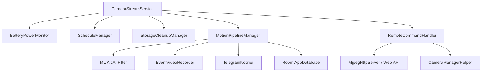

# OcularNode 👁️

[English](README_en.md) | [正體中文](README.md)

[](https://github.com/iokkai/OcularNode/actions)
[](https://www.gnu.org/licenses/gpl-3.0)
[](https://android-arsenal.com/api?level=24)

> 📱 **Transform spare Android smartphones into dedicated, high-performance smart surveillance cameras.**  
> 將閒置舊 Android 手機化身為專業、低功耗、支援安全內網穿透的專用智慧監控節點。

> [!IMPORTANT]
> 🔒 **100% 無中央伺服器・極致隱私保障 (Zero Central Server / Decentralized)**  
> **OcularNode 絕無架設任何外部中央雲端伺服器！**  
> 所有即時影像、錄影檔案與雙向對講音訊，**完全僅在您的家庭區域網路 (LAN) 內直連傳輸，或透過自建之端到端加密 VPN (如 Tailscale WireGuard®) 安全傳送**。所有監控資料絕不上傳任何第三方雲端中繼站，由您掌握 100% 的數位主權與隱私！

---

## 🌟 核心特色 (Core Features)

- 🛡️ **無中央伺服器與零雲端中繼 (100% Local & Decentralized)**：
  - 不依賴任何廠商雲端平台或中繼伺服器，無帳號訂閱費、無雲端外洩風險。
  - 監控端 (Viewer) 與相機端 (Node) 採 P2P / 本地直連架構，離線斷網亦可在區網內 100% 正常運作。
- 🌐 **雙連線模式 (區域網路直連 + 遠端安全穿透)**：
  - **🏠 家中 Wi-Fi 區網直連**：同區網內免設定直接連線（支援 `192.168.x.x` 等本地 IP），超低延遲、免連外網、完全保障隱私與離線可用。
  - **🔒 Tailscale / VPN 跨網遠端安全串流**：出門在外可搭配 Tailscale VPN 遠端存取，自動識別 CGNAT (`100.64.0.0/10`) 網段，所有流量皆經由 WireGuard® 端到端強加密，無需暴露公網 IP 或設定路由器 Port Forwarding。
- 🪄 **Device Owner 專用設備部署精靈 (Zero-Touch Provisioning)**：
  - 支援專用 QR Code 掃描快速配網。
  - 支援注入 Tailscale Auth Key 自動配置並啟用 VPN（需已安裝 Tailscale）。
  - 鎖定 Kiosk 模式、開機自啟動、自訂省電黑屏監控。
- ⚡ **雙模式架構 (Dual-Mode Architecture)**：
  - **Camera (節點模式)**：低功耗後台 MJPEG HTTP 串流服務、雙向即時對講、鏡頭自動夜視切換。
  - **Viewer (監控端模式)**：多鏡頭即時預覽牆、低延遲 MJPEG 播放、遠端鏡頭設定與即時廣播。
- 🧠 **邊緣 AI 動態偵測 (Edge AI Motion Detection)**：
  - 像素級畫面動態差分分析。
  - Google ML Kit 物件識別過濾（人、動物、車輛等智慧分類）。
  - 自動錄製前置緩衝 + 事件短片 (Pre-record buffer)。
- 📲 **Telegram 即時推播 (Telegram Bot Alerts)**：
  - 動態觸發即時傳送照片快照與短片通知。
  - 支援市電斷電/復電警報與低電量預警。
  - 支援高溫過熱 (45°C) 降頻保護告警與低溫恢復通知。
  - 支援 Tailscale VPN 異常中斷與 180 天金鑰可能過期之預警通知。
- 🔄 **靜默 OTA 自動更新 (Silent OTA Update)**：直接對接 GitHub Releases，自動檢查最新版並於背景無縫完成更新。

---

## 🏗️ 系統架構 (Architecture)



- **狀態與資料持久化**：Jetpack DataStore + EncryptedSharedPreferences (MasterKey 加密保護憑證) + Room (安全增量 Migration)。
- **UI 介面**：Jetpack Compose + Material 3 Design System (全域統一語義色彩 Token)。

---

## 💡 Tailscale 180 天金鑰過期說明與停用方式 (Disable Key Expiry)

- **預設過期機制**：Tailscale 預設會為加入網路的裝置啟用 180 天金鑰過期機制 (Key Expiry)。
- **一鍵停用過期（推薦 24/7 常駐相機設定）**：
  1. 打開 [Tailscale 控制台裝置清單 (Machines)](https://login.tailscale.com/admin/machines)。
  2. 找到您的舊手機裝置，點擊右側的 **`...` (選單)**。
  3. 點選 **「Disable Key Expiry」 (停用金鑰過期)**，相機即可 365 天永久常駐連線不中斷！
- **自動過期告警**：若未停用過期且相機滿 180 天斷線，OcularNode 監控服務會在區網連線正常時透過 Telegram 發送斷線與過期提醒。

---

## 🛠️ 開發與編譯 (Build & Development)

### 系統需求
- **Android Studio**: Ladybug / Meerkat (或最新版本)
- **JDK**: Java 17+ (推薦使用 Android Studio 內建 JBR)
- **Min SDK**: API 24 (Android 7.0)
- **Target SDK**: API 36 (Android 16)

### 編譯指令 (Gradle CLI)

```bash
# 執行單元測試
./gradlew testArmDebugUnitTest

# 編譯 Debug APK (ARM 架構)
./gradlew assembleArmDebug

# 編譯 Release APK
./gradlew assembleRelease
```

---

## 🔐 安全性與隱私說明 (Security & Privacy)

1. **無中央伺服器 (Zero Central Server)**：本專案為完全去中心化架構，絕不設立任何集中式雲端伺服器或轉發站。
2. **區網與 VPN 保護 (LAN-Only / VPN Encryption)**：所有影音串流預設僅在本地 Wi-Fi 區域網路內廣播；遠端存取則透過加密 VPN (Tailscale WireGuard®) 建立私有網路傳輸，全程點對點加密保護。
3. **HTTP PIN 碼安全鑑權**：內建 HTTP PIN 授權保護，防止區網內未授權設備存取串流、下載錄影或監聽麥克風。
4. **憑證硬體級加密**：Telegram Bot Token 與 Tailscale Auth Key 一律由 Android Jetpack `EncryptedSharedPreferences` 配合 Android KeyStore 硬體金鑰加密儲存。
5. **防範資料外洩**：全域停用 `allowBackup`，杜絕未授權的 ADB 實體備份提取私密資料。
6. **零追蹤器與廣告**：絕無任何第三方商業廣告、分析統計或後門 SDK，保障 100% 純淨隱私。

---

## 📜 授權協議 (License)

本專案採用 [GPL-3.0 License](LICENSE) 開源授權。
