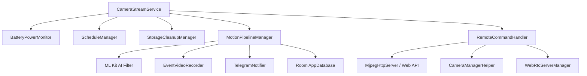

<p align="center">
  
</p>

<h1 align="center">OcularNode</h1>

<p align="center">
  <b>舊手機轉生專用・去中心化 P2P 智慧監控系統 (Zero Central Server / Decentralized Smart Camera)</b>
</p>

> [!WARNING]
> ⚠️ **專案處於開發階段宣告 (Experimental Project Notice)**  
> 本專案目前仍處於密集開發與實驗階段，**所有功能皆不穩定且可能隨時變動**。請勿使用於高度關鍵性或高風險安防場景。歡迎提出 Issue、回報 Bug 與參與測試！

> [!IMPORTANT]
> 🔒 **100% 無中央伺服器・極致隱私保障 (Zero Central Server / Decentralized)**  
> **OcularNode 絕無架設任何外部中央雲端伺服器！**  
> 所有即時影像、錄影檔案與雙向對講音訊，**完全僅在您的家庭區域網路 (LAN) 內直連傳輸，或透過 Google WebRTC P2P 端對端加密直連安全傳送**。所有監控資料絕不上傳任何第三方雲端中繼站，由您掌握 100% 的數位主權與隱私！

---

## 🌟 核心特色 (Core Features)

- 🛡️ **無中央伺服器與零雲端中繼 (100% Local & Decentralized)**：
  - 不依賴任何廠商雲端平台或中繼伺服器，無帳號訂閱費、無雲端外洩風險。
  - 監控端 (Viewer) 與相機端 (Node) 採 WebRTC P2P / 本地直連架構，離線斷網亦可在區網內 100% 正常運作。
- 🌐 **雙連線模式 (區域網路直連 + WebRTC P2P 極速穿透)**：
  - **🏠 家中 Wi-Fi 區網直連**：同區網內免設定直接連線（支援 `192.168.x.x` 與 IPv6），超低延遲、免連外網、完全保障隱私與離線可用。
  - **⚡ WebRTC P2P 跨網遠端安全串流**：出門在外透過標準 WebRTC (ICE / STUN 打洞與 E2EE 端對端加密) 實現毫秒級超低延遲直連，無需暴露公網 IP 或設定路由器 Port Forwarding。
- 🪄 **Device Owner 專用設備部署精靈 (Zero-Touch Provisioning)**：
  - 支援專用 QR Code 掃描快速配網與配置 E2EE 配對金鑰。
  - 鎖定 Kiosk 模式、開機自啟動、自訂省電黑屏監控。
- ⚡ **雙模式架構 (Dual-Mode Architecture)**：
  - **Camera (節點模式)**：低功耗後台 WebRTC / MJPEG 串流服務、雙向即時對講、鏡頭自動夜視切換。
  - **Viewer (監控端模式)**：多鏡頭即時預覽牆、低延遲 WebRTC 播放、遠端鏡頭設定與即時廣播。
- 🧠 **邊緣 AI 動態偵測 (Edge AI Motion Detection)**：
  - 像素級畫面動態差分分析。
  - Google ML Kit 物件識別過濾（人、動物、車輛等智慧分類）。
  - 自動錄製前置緩衝 + 事件短片 (Pre-record buffer)。
- 📲 **Telegram 即時推播 (Telegram Bot Alerts)**：
  - 動態觸發即時傳送照片快照與短片通知。
  - 支援市電斷電/復電警報與低電量預警。
  - 支援高溫過熱 (45°C) 降頻保護告警與低溫恢復通知。
- 🔄 **靜默 OTA 自動更新 (Silent OTA Update)**：直接對接 GitHub Releases，自動檢查最新版並於背景無縫完成更新。

---

## 🏗️ 系統架構 (Architecture)



- **狀態與資料持久化**：Jetpack DataStore + EncryptedSharedPreferences (MasterKey 加密保護憑證) + Room (安全增量 Migration)。
- **UI 介面**：Jetpack Compose + Material 3 Design System (全域統一語義色彩 Token)。

---

## 🛠️ 開發與編譯 (Build & Development)

### 系統需求
- **Android Studio**: Ladybug / Meerkat (或最新版本)
- **JDK**: Java 17+ (推薦使用 Android Studio 內建 JBR)
- **Min SDK**: API 24 (Android 7.0)
- **Target SDK**: API 36 (Android 16)

### 編譯指令 (Gradle CLI)

```bash
# 執行單元測試
./gradlew testArmDebugUnitTest

# 編譯 Debug APK (ARM 架構)
./gradlew assembleArmDebug

# 編譯 Release APK
./gradlew assembleRelease
```

---

## 🔐 安全性與隱私說明 (Security & Privacy)

1. **無中央伺服器 (Zero Central Server)**：本專案為完全去中心化架構，絕不設立任何集中式雲端伺服器或轉發站。
2. **區網與 WebRTC P2P 保護 (LAN-Only & E2EE P2P)**：所有影音串流預設在本地 Wi-Fi 區域網路內直連；遠端存取則透過端對端加密 WebRTC P2P (DTLS-SRTP) 傳輸，全程點對點加密保護。
3. **HTTP PIN 碼安全鑑權**：內建 HTTP PIN 授權保護，防止區網內未授權設備存取串流、下載錄影或監聽麥克風。
4. **憑證硬體級加密**：Telegram Bot Token 與配對金鑰一律由 Android Jetpack `EncryptedSharedPreferences` 配合 Android KeyStore 硬體金鑰加密儲存。
5. **防範資料外洩**：全域停用 `allowBackup`，杜絕未授權的 ADB 實體備份提取私密資料。
6. **零追蹤器與廣告**：絕無任何第三方商業廣告、分析統計或後門 SDK，保障 100% 純淨隱私。

---

## 📜 授權協議與隱私政策 (License & Privacy)

* 軟體授權條款：[GNU General Public License v3.0](LICENSE)
* 隱私權政策與使用條款：[PRIVACY.md](PRIVACY.md)
