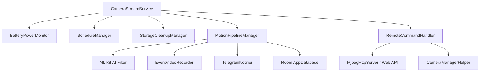

# OcularNode 👁️

[English](README_en.md) | [繁體中文](README.md)

[](https://github.com/iokkai/OcularNode/actions)
[](https://www.gnu.org/licenses/gpl-3.0)
[](https://android-arsenal.com/api?level=24)

> 📱 **Transform spare Android smartphones into dedicated, high-performance smart surveillance cameras.**  
> 將閒置舊 Android 手機化身為專業、低功耗、支援安全內網穿透的專用智慧監控節點。

---

## 🌟 核心特色 (Core Features)

- 🔒 **全內網安全串流 (Tailscale Integration)**：內建 Tailscale CGNAT (100.64.0.0/10) 網段識別與遠端安全穿透，不需暴露公網 IP 或設定 Port Forwarding。
- 🪄 **Device Owner 專用設備部署精靈 (Zero-Touch Provisioning)**：
  - 支援專用 QR Code 掃描快速配網。
  - 自動背景安裝並配置 Tailscale VPN。
  - 鎖定 Kiosk 模式、開機自啟動、自訂省電黑屏監控。
- ⚡ **雙模式架構 (Dual-Mode Architecture)**：
  - **Camera (節點模式)**：低功耗後台 MJPEG HTTP 串流服務、雙向即時對講、鏡頭自動夜視切換。
  - **Viewer (監控端模式)**：多鏡頭即時預覽牆、低延遲 MJPEG 播放、遠端鏡頭設定與即時廣播。
- 🧠 **邊緣 AI 動態偵測 (Edge AI Motion Detection)**：
  - 像素級畫面動態差分分析。
  - Google ML Kit 物件識別過濾（人、動物、車輛等智慧分類）。
  - 自動錄製前置緩衝 + 事件短片 (Pre-record buffer)。
- 📲 **Telegram 即時推播 (Telegram Bot Alerts)**：
  - 動態觸發即時傳送照片快照與短片通知。
  - 支援市電斷電/復電警報與低電量預警。
  - 支援高溫過熱 (45°C) 降頻保護告警與低溫恢復通知。
- 🔄 **靜默 OTA 自動更新 (Silent OTA Update)**：直接對接 GitHub Releases，自動檢查最新版並於背景無縫完成更新。

---

## 🏗️ 系統架構 (Architecture)



- **狀態與資料持久化**：Jetpack DataStore + EncryptedSharedPreferences (MasterKey 加密保護憑證) + Room (安全增量 Migration)。
- **UI 介面**：Jetpack Compose + Material 3 Design System (全域統一語義色彩 Token)。

---

## 🛠️ 開發與編譯 (Build & Development)

### 系統需求
- **Android Studio**: Ladybug / Meerkat (或最新版本)
- **JDK**: Java 17+ (推薦使用 Android Studio 內建 JBR)
- **Min SDK**: API 24 (Android 7.0)
- **Target SDK**: API 36 (Android 16)

### 編譯指令 (Gradle CLI)

```bash
# 執行單元測試
./gradlew testArmDebugUnitTest

# 編譯 Debug APK (ARM 架構)
./gradlew assembleArmDebug

# 編譯 Release APK
./gradlew assembleRelease
```

---

## 🔐 安全性說明 (Security)

1. **憑證安全**：Telegram Bot Token 與 Tailscale Auth Key 一律由 Android Jetpack `EncryptedSharedPreferences` 配合 Android KeyStore 硬體級金鑰加密儲存。
2. **防範資料外洩**：應用程式全域停用 `allowBackup`，防止未授權的 ADB Backup 提取憑證。
3. **無追蹤器**：無第三方商業廣告或分析追蹤 SDK，完全保障隱私。

---

## 📜 授權協議 (License)

本專案採用 [GPL-3.0 License](LICENSE) 開源授權。
