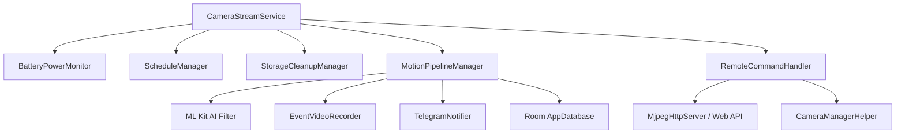

# OcularNode 👁️

[English](README_en.md) | [正體中文](README.md)

[](https://github.com/iokkai/OcularNode/actions)
[](https://www.gnu.org/licenses/gpl-3.0)
[](https://android-arsenal.com/api?level=24)

> 📱 **Transform spare Android smartphones into dedicated, high-performance smart surveillance cameras.**

---

## 🌟 Core Features

- 🔒 **Secure Private Mesh Streaming (Tailscale Support)**: Supports Tailscale VPN mesh network, with automatic Tailscale CGNAT (`100.64.0.0/10`) subnet recognition and secure NAT traversal. No public IP exposure or port forwarding required (Tailscale app installation required on the device).
- 🪄 **Device Owner Zero-Touch Provisioning Wizard**:
  - Fast network setup via dedicated QR code scanning.
  - Supports automatic Tailscale Auth Key configuration and VPN connection (with Tailscale installed).
  - Dedicated Kiosk lock mode, auto-start on boot, and customized screen-off power-saving monitoring.
- ⚡ **Dual-Mode Architecture**:
  - **Camera (Node Mode)**: Low-power background MJPEG HTTP streaming service, two-way live intercom, auto night vision switching.
  - **Viewer (Monitor Mode)**: Multi-camera live grid view, low-latency MJPEG playback, remote camera configuration, and live audio broadcast.
- 🧠 **Edge AI Motion Detection**:
  - Frame-differential pixel analysis.
  - Google ML Kit object recognition and categorization filter (human, animal, vehicle, etc.).
  - Automated pre-record buffer and event video generation.
- 📲 **Telegram Bot Alerts**:
  - Instant motion alerts with photo snapshot and video clip delivery.
  - Power cut (unplugged) / power restored alerts and low-battery warnings.
  - High-temperature thermal throttling protection (45°C) alert and recovery notification.
- 🔄 **Silent OTA Updates**: Direct integration with GitHub Releases to check and update seamlessly in the background.

---

## 🏗️ System Architecture



- **State & Data Persistence**: Jetpack DataStore + EncryptedSharedPreferences (Hardware MasterKey encrypted credentials) + Room (Incremental non-destructive migrations).
- **UI Architecture**: Jetpack Compose + Material 3 Design System (Centralized Semantic Design Tokens).

---

## 🛠️ Build & Development

### Requirements
- **Android Studio**: Ladybug / Meerkat (or latest version)
- **JDK**: Java 17+ (Recommended: Android Studio Embedded JBR)
- **Min SDK**: API 24 (Android 7.0)
- **Target SDK**: API 36 (Android 16)

### Gradle CLI Commands

```bash
# Run unit test suite
./gradlew testArmDebugUnitTest

# Build Debug APK (ARM Architecture)
./gradlew assembleArmDebug

# Build Release APK
./gradlew assembleRelease
```

---

## 🔐 Security & Privacy

1. **Credential Protection**: Telegram Bot Token and Tailscale Auth Key are securely stored using Android Jetpack `EncryptedSharedPreferences` backed by the Android KeyStore hardware master key.
2. **Prevent Data Leakage**: Global `allowBackup` is strictly set to `false`, preventing unauthorized ADB backup extraction.
3. **Zero Trackers**: No third-party commercial advertisements, analytics, or tracking SDKs. Complete user privacy guaranteed.

---

## 📜 License

This project is licensed under the [GNU General Public License v3.0 (GPL-3.0)](LICENSE).
