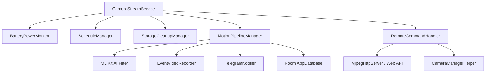

# OcularNode 👁️

[English](README_en.md) | [正體中文](README.md)

[](https://github.com/iokkai/OcularNode/actions)
[](https://github.com/iokkai/OcularNode)
[](https://www.gnu.org/licenses/gpl-3.0)
[](https://android-arsenal.com/api?level=24)

> 📱 **Transform spare Android smartphones into dedicated, high-performance smart surveillance cameras.**

> [!WARNING]
> ⚠️ **Project Under Active Development (WIP / Experimental)**  
> This project is under intensive development. **All features are currently experimental, unstable, and subject to breaking changes.** It is not intended for mission-critical security setups. Feedback, issues, and PRs are warmly welcome!

> [!IMPORTANT]
> 🔒 **100% Zero Central Server・Maximum Privacy Guarantee**  
> **OcularNode operates without any external central or cloud servers!**  
> All live video streams, event recordings, and two-way audio communications are **strictly transmitted directly within your local home network (LAN) or protected through your self-managed, end-to-end encrypted VPN (such as Tailscale WireGuard®)**. Your camera feed is never routed through third-party cloud relays.

---

## 🌟 Core Features

- 🛡️ **Zero Central Server & 100% Decentralized Architecture**:
  - No dependency on vendor cloud platforms, subscription fees, or cloud leakage risks.
  - Direct P2P / local connection between Viewer and Camera Node with full offline availability.
- 🌐 **Dual Connection Modes (Local LAN Direct & Remote Traversal)**:
  - **🏠 Home Wi-Fi Direct (LAN)**: Connect directly over local Wi-Fi (`192.168.x.x`) with zero external dependency, ultra-low latency, and complete offline privacy.
  - **🔒 Remote Mesh Streaming (Tailscale / VPN Support)**: Seamless remote access from anywhere. Ultimate Security: Powered by modern [WireGuard® encryption](https://tailscale.com/blog/how-tailscale-works/), devices establish direct peer-to-peer (P2P) connections so even Tailscale cannot view your video feeds. Automatic CGNAT (`100.64.0.0/10`) recognition without exposing public IPs or configuring router port forwarding.
- 🪄 **Device Owner Zero-Touch Provisioning Wizard**:
  - Fast network setup via dedicated QR code scanning.
  - Supports automatic Tailscale Auth Key configuration and VPN connection (with Tailscale installed).
  - Dedicated Kiosk lock mode, auto-start on boot, and customized screen-off power-saving monitoring.
- ⚡ **Dual-Mode Architecture**:
  - **Camera (Node Mode)**: Low-power background MJPEG HTTP streaming service, two-way live intercom, auto night vision switching.
  - **Viewer (Monitor Mode)**: Multi-camera live grid view, low-latency MJPEG playback, remote camera configuration, and live audio broadcast.
- 🧠 **Edge AI Motion Detection**:
  - Frame-differential pixel analysis.
  - Google ML Kit object recognition and categorization filter (human, animal, vehicle, etc.).
  - Automated pre-record buffer and event video generation.
- 📲 **Telegram Bot Alerts**:
  - Instant motion alerts with photo snapshot and video clip delivery.
  - Power cut (unplugged) / power restored alerts and low-battery warnings.
  - High-temperature thermal throttling protection (45°C) alert and recovery notification.
  - Tailscale VPN disconnection and 180-day key expiry warning alerts.
- 🔄 **Silent OTA Updates**: Direct integration with GitHub Releases to check and update seamlessly in the background.

---

## 🏗️ System Architecture



- **State & Data Persistence**: Jetpack DataStore + EncryptedSharedPreferences (Hardware MasterKey encrypted credentials) + Room (Incremental non-destructive migrations).
- **UI Architecture**: Jetpack Compose + Material 3 Design System (Centralized Semantic Design Tokens).

---

## 💡 Tailscale 90-Day Key vs 180-Day Device Expiry Guide (Permanent Connectivity)

Tailscale utilizes two distinct validity mechanisms for different security purposes:

| Mechanism | Expiration Period | Purpose & Explanation | Impact on Security Camera |
| :--- | :--- | :--- | :--- |
| **API Access Token / Auth Key** | **Max 90 Days** | Used by OcularNode during provisioning, QR code generation, or invoking Tailscale Admin APIs. | **No Impact**. Expiring after 90 days only prevents using the same token for new device setups; **connected cameras continue running normally without interruption**. |
| **Node / Device Key Expiry** | **180 Days (Default)** | Tailscale's security policy requires enrolled devices (nodes) to re-authenticate every 180 days by default. | **Action Required**. If not disabled, the camera will disconnect after 180 days. |

### 🚀 How to Achieve 24/7/365 Permanent Connection (Disable 180-Day Expiry)
1. **API Key Setup (Recommended)**: On the OcularNode Viewer screen, the app will automatically monitor key expiry and provide a **"⚡ Disable 180-Day Key Expiry"** button to permanently authorize the camera with one tap.
2. **Manual Tailscale Web Console**:
   1. Open [Tailscale Admin Console (Machines)](https://login.tailscale.com/admin/machines).
   2. Locate your camera device and click the **`...` (menu)** on the right.
   3. Select **"Disable Key Expiry"**. Your camera will stay permanently connected 24/7/365!
- **Automatic Disconnect Alert**: If key expiry triggers a disconnect, OcularNode will detect it and send a warning via Telegram as long as the device is connected to local Wi-Fi.

---

## 🛠️ Build & Development

### Requirements
- **Android Studio**: Ladybug / Meerkat (or latest version)
- **JDK**: Java 17+ (Recommended: Android Studio Embedded JBR)
- **Min SDK**: API 24 (Android 7.0)
- **Target SDK**: API 36 (Android 16)

### Gradle CLI Commands

```bash
# Run unit test suite
./gradlew testArmDebugUnitTest

# Build Debug APK (ARM Architecture)
./gradlew assembleArmDebug

# Build Release APK
./gradlew assembleRelease
```

---

## 🔐 Security & Privacy

1. **Zero Central Server**: Fully decentralized architecture. No central cloud servers, relay stations, or intermediate proxies.
2. **LAN-Only & Encrypted VPN**: Video and audio streams are broadcast strictly within your local home network (LAN) by default. Remote connections are established over private, end-to-end encrypted VPN meshes (Tailscale WireGuard®).
3. **HTTP PIN Authentication**: Protects streaming endpoints, recordings, and microphone access against unauthorized local network access.
4. **Hardware-Backed Credential Security**: Telegram Bot Token and Tailscale Auth Key are encrypted using Android Jetpack `EncryptedSharedPreferences` backed by the Android KeyStore hardware master key.
5. **Prevent Data Extraction**: Global `allowBackup` is disabled to prevent unauthorized ADB physical backup extractions.
6. **Zero Trackers & Ads**: Zero commercial tracking SDKs, analytics, or third-party advertisements. Complete user privacy guaranteed.

---

## 📜 License & Privacy
 
* Software License: [GNU General Public License v3.0 (GPL-3.0)](LICENSE)
* Privacy Policy & Terms of Use: [PRIVACY.md](PRIVACY.md)
